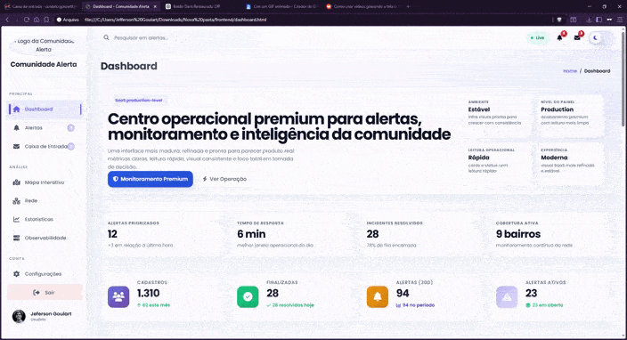

# 🚨 Comunidade Alerta

<p align="center">
  <strong>Dashboard SaaS para monitoramento, análise e inteligência de alertas comunitários</strong>
</p>

<p align="center">
  Interface moderna inspirada em plataformas como Datadog, Vercel, Linear e Notion
</p>

<p align="center">


</p>

---

## 🎥 Preview do sistema

<p align="center">
  
</p>

---

## ✨ Sobre o projeto

O **Comunidade Alerta** é um dashboard com proposta **SaaS production-level**, desenvolvido para simular um centro operacional de monitoramento, análise e inteligência comunitária.

O sistema foi projetado para transmitir a sensação de um **produto real**, com foco em:

* leitura rápida de dados
* visual moderno e consistente
* tomada de decisão baseada em métricas
* experiência fluida e profissional

Este projeto faz parte do meu **portfólio**, com foco em UI/UX, frontend e arquitetura de produto.

---

## 🧠 Inspirações

Este projeto foi inspirado em produtos como:

* Datadog
* Vercel
* Linear
* Supabase
* Notion Analytics

---

## 🖥️ Módulos do sistema

### 📊 Dashboard

* alertas priorizados
* tempo médio de resposta
* incidentes resolvidos
* atividade recente
* tendência de ocorrências

### 🌐 Rede

* participantes ativos
* engajamento da rede
* status operacional
* insights estratégicos

### 📈 Estatísticas

* volume de ocorrências
* tipos de alerta
* radar operacional
* status das ocorrências

### ✉️ Caixa de Entrada

* notificações
* alertas urgentes
* mensagens operacionais

### ⚙️ Configurações

* perfil do usuário
* segurança da conta
* autenticação em duas etapas

---

## 🏗️ Estrutura do projeto

```bash
frontend/
├── dashboard.html
├── css/
│   └── dashboard.css
├── js/
│   └── dashboard.js
└── img/
```

---

## 🛠️ Tecnologias utilizadas

* HTML5
* CSS3
* JavaScript
* Chart.js
* Font Awesome

---

## 🚀 Como executar

```bash
git clone https://github.com/seu-usuario/comunidade-alerta
cd comunidade-alerta
```

Abra no navegador:

```bash
frontend/dashboard.html
```

---

## 📍 Roadmap

* [ ] Backend com Node.js
* [ ] API REST de alertas
* [ ] Autenticação JWT
* [ ] Banco de dados
* [ ] Tempo real (WebSocket)
* [ ] Mapa interativo
* [ ] Notificações push

---

## 🎯 Objetivo do projeto

* construir dashboards SaaS modernos
* simular um produto real
* compor portfólio profissional

---

## 👨‍💻 Autor

**Jeferson Goulart**
📍 Santa Catarina — Brasil
---

## 📄 Licença

Este projeto está sob licença **MIT**.

